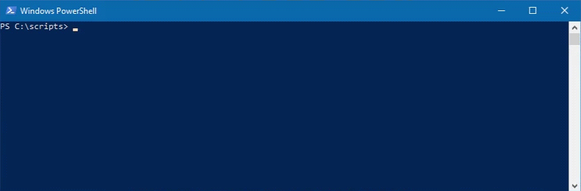
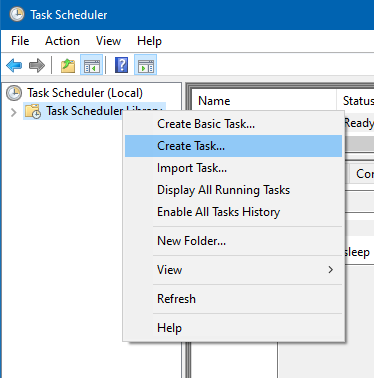
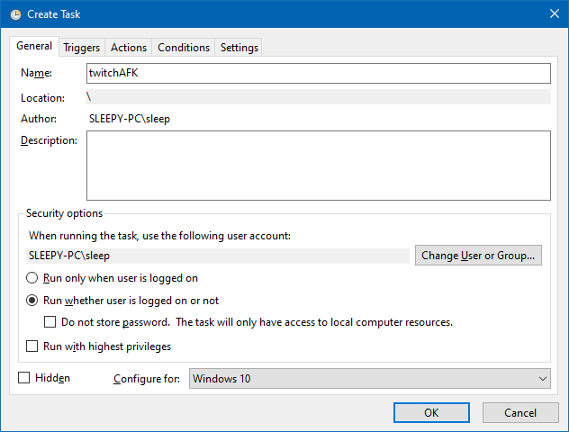
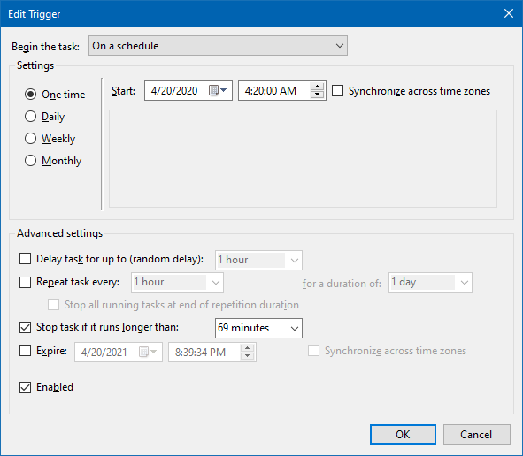
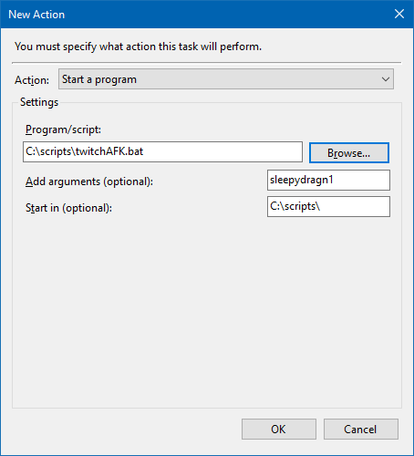

# twitchAFK
A SlimerJS script for idling a Twitch channel.

Its primary use is to earn Twitch drops, but it could have other uses as well.

## Setup
1. Download the repo.
2. Install [SlimerJS](https://slimerjs.org/download.html).
3. Download and run the [Firefox 59.0.3 installer](https://ftp.mozilla.org/pub/firefox/releases/59.0.3/) (not the most recent version of Firefox, it's unsupported by SlimerJS).
4. When installing, choose "Custom" and install to a non-default directory to avoid conflicts with the main release of Firefox. Uncheck "Install Maintenance Service".
5. Open Firefox 59.0.3, navigate to Options > General > Firefox Updates, and set it to "Never check for updates (not recommended)".

**A warning:** Never use Help > About Firefox. Mozilla takes this as a cue to ignore your user settings and shove the latest update down your throat.

6. [Configure SlimerJS's variables to point to your new Firefox installation.](https://docs.slimerjs.org/current/installation.html#configuring-slimerjs)
7. *(Optional)* Add SlimerJS' install folder to your PATH variable. If you want to use SlimerJS without specifying its location every time, this is a neccessary step. Further, all of the example commands listed below assume you've done so. [If you're unfamiliar with the process, this is a good Windows-based guide to it.](https://www.howtogeek.com/118594/how-to-edit-your-system-path-for-easy-command-line-access/)
8. Fill out the `exports.username` and `exports.password` fields in twitchAFKConfig.js to reflect your Twitch account's username and password. While you're there, you'll probably want to customize the rest of the configuration file to fit your specific needs.

**A plea:** Please, please, *please* be contentious of other chat-goers and the streamer themselves when setting the ChatSpamRate options. Never set them below 2 minutes, and preferrably have them set higher than that. Nobody likes spam, and we're only really using it here to make it look like we're home. 

9. Run `slimerjs -CreateProfile [SlimerJS profile name]` to create a profile for the script to use. Ex: `slimerjs -CreateProfile twitchAFK`
10. Run the script without the --headless flag initially (ex: `slimerjs -P twitchAFK twitchAFK.js sleepydragn1`), and verify that it's working. You may need to fill out a CAPTCHA, complete two factor authentication, or verify your account via some other means for this first run. If you do run into one of these authentication stumbling blocks, assuming that you have `exports.furtherAuthDetection` enabled, the console will note "further authentication required," and the script will give you time to complete that authentication. After this, as long as you're using that same profile, twitchAFK should stay logged in and require no further user input.

## Command-line Syntax
The basic command to use the script is:

```
slimerjs --headless -P [SlimerJS profile name] twitchAFK.js [Twitch channel]
```

The Twitch channel argument is *optional*, and if not specified, the script will use the channel option from the configuration file.

For example:

```
slimerjs --headless -P twitchAFK twitchAFK.js sleepydragn1
```

or

```
slimerjs --headless -P twitchAFK twitchAFK.js
```

or

```
"C:\Tools\SlimerJS\slimerjs.bat" --headless -P twitchAFK twitchAFK.js sleepydragn1
```

## Command-line Arguments

Note that none of these commands will permanently alter any configuration file. They're just meant to change the session that they launch.
```
-u [username]
    Set the username. Note that this will do nothing if you're using a profile that is already logged in.
    Example: slimerjs --headless -P twitchAFK twitchAFK.js -u AzureDiamond
-p [password]
    Set the password. Note that this will do nothing if you're using a profile that is already logged in.
    Example: slimerjs --headless -P twitchAFK twitchAFK.js -p hunter2
-c [config filename or path]
    Use an alternate configuration file. Can utilize either a simple filename or a full path.
    Example: slimerjs --headless -P twitchAFK twitchAFK.js -c twitchAFKConfigAlt.js
    Example: slimerjs --headless -P twitchAFK twitchAFK.js -c "C:\scripts\alt\twitchAFKConfigAlt.js"
-k [key] [value]
    Alter a specific configuration key. 
    Can be chained together with other -k flags to alter multiple keys.
    Example: slimerjs --headless -P twitchAFK twitchAFK.js -k maxQuality 1080p
    Example: slimerjs --headless -P twitchAFK twitchAFK.js -k width 1000 -k height 500 -k pointTracker false
    For arrays like chatSpams, it uses a very similiar format as the config file, 
    except using single quotes rather than double quotes.
    Example: slimerjs --headless -P twitchAFK twitchAFK.js -k chatSpams "['LUL', 'TPFufun', 'VoteYea']"
```

## Profiles

Using a profile for SlimerJS will allow it to store cookie and session information, meaning that it can remember your login. This allows for a slightly faster script startup, and will help to avoid problems with Twitch's CAPTCHAs, two factor authentication, or other impediments to logging in.

Run `slimerjs -CreateProfile [SlimerJS profile name]` to create a profile, and then append `-P [SlimerJS profile name]` to any slimerJS command to use that profile.

For example:

```
slimerjs -CreateProfile altAccount
slimerjs --headless -P altAccount twitchAFK.js sleepydragn1
```

Note that due to limitations with SlimerJS, only one instance of the script can be run per profile. As such, if you're planning on running multiple instances, **each instance must have its own profile.**

## Headless Mode

The `--headless` flag allows SlimerJS to run the script in headless mode, meaning that it won't create a window containing the browser while it's being run. 

Ex:

With headless mode *enabled*:

```
slimerjs --headless -P twitchAFK twitchAFK.js sleepydragn1
```

With headless mode *disabled*:

```
slimerjs -P twitchAFK twitchAFK.js sleepydragn1
```

Upon the first time setup of a profile, you'll likely need to run the script without the headless flag. Other than that, unless you're running into issues and want to visually see what's going wrong, or want to monitor the script in person, there's no real need to run it without the flag.

## You're ready to go!

Now you just need to set it up with a program for automatic scheduling. I've included an example tutorial for Windows users planning on using Task Scheduler below.

## Task Scheduler Example

First, setup a .bat script with your given command. For example:

```
slimerjs --headless -P twitchAFK twitchAFK.js %1
```

In this, %1 will be used to pass on an argument, which we'll use to specify the channel we want to AFK.

After that, we'll set up our task in Task Scheduler. Start by creating a task via Task Scheduler (Local) > Task Scheduler Library > Create Task...



Under the "General" tab, fill out the "Name" field, and click "Run whether user is logged on our not". This will allow the script to run in the background without popping up a cmd window.



Switch to the "Triggers" tab. Click "New..." and create a trigger for the times you want the script to run. In this example, we want the script to run once on 4/20/2020 at 4:20 AM. So we'll select "One time" on the left, and fill out that date and time next to "Start". We're also going to set "Stop task if it runs longer than" to the duration we want the script to run, which will stop the script after that amount of time. In this case, 69 minutes. Note that we're not limited to the drop-down's pre-selected times — we can simply type in whatever custom amount of time we want. For example: "18 minutes" or "3 hours" or "2 days" or for a really precise amount of time, "128 minutes".



Now, switch to the "Actions" tab. Click "New..." and set it up to run the .bat script we created. In this example, we've put that .bat file, named "twitchAFK.bat" and the actual twitchAFK.js script files in the same folder, "C:\scripts". Set the "Program/script" to the .bat file, fill out the Twitch channel name under "Add arguments (optional)" and set "Start in (optional)" to the aforementioned folder. Click "OK".



After this, we just need click "OK" one more time, and it should be set up. Hopefully this can serve as a jumping-off point for your use!

## Q&A

**Q:** I screwed up my configuration file. What do?

**A:** You can either redownload the default one from this repo, or more easily, you can delete your existing file and the script will recreate it with default values upon launch.

---

**Q:** I'm running into Captchas, please help?

**A:** Start using the profile system, you degenerate.

---

**Q:** Is refreshing the page, pausing and resuming the stream, or spamming the chat really neccessary to get drops?

**A:** No idea, since Twitch doesn't really make it clear. Regardless, I'm not taking any chances.

---

**Q:** I'm running into crashes or other problems. Why are you doing this to me? What did I ever do to you?

**A:** Check your log files — most errors that this script reports should be fairly self-explanatory. If those logs don't list anything unusual, try enabling `exports.printJSConsole` and `exports.printJSErrors` for additional information.

If you're still having an issue, or the problem in question is a genuine bug with the script, you can always use the issues board on Github to ask for help. Make sure you include specific information about your setup, the problem, and relevant logs. I'll do my best to help.

---

**Q:** Isn't this a bit unethical?

**A:** I don't know, man, I work during the day. If I could watch all the Rainbow 6 Pro League streams I would, but for now I'd like to still earn those charms. Besides, who's it harming?

---

**Q:** You suck, and this script sucks.

**A:** That's not a question.
