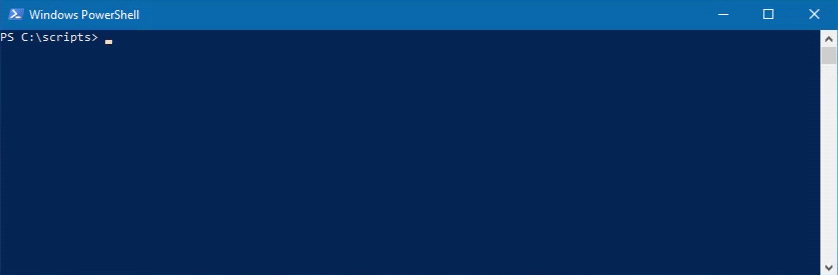

# twitchAFK
A SlimerJS script for idling a Twitch channel.

Its primary use is to earn Twitch drops, but it could have other uses as well.

## Setup
1. Download the repo.
2. Install [SlimerJS](https://slimerjs.org/download.html).
3. Download and run the [Firefox 59.0.3 installer](https://ftp.mozilla.org/pub/firefox/releases/59.0.3/) (not the most recent version of Firefox, it's unsupported by SlimerJS).
4. When installing, choose "Custom" and install to a non-default directory to avoid conflicts with the main release of Firefox. Uncheck "Install Maintenance Service".
5. Open Firefox 59.0.3, navigate to Options > General > Firefox Updates, and set it to "Never check for updates (not recommended)".

**A warning:** Never use Help > About Firefox. Mozilla takes this as a cue to ignore your user settings and shove the latest update down your throat.

6. [Configure SlimerJS's variables to point to your new Firefox installation.](https://docs.slimerjs.org/current/installation.html#configuring-slimerjs)
7. Configure the twitchAFKConfig.js file and ensure you've set your Twitch username and password correctly.

**A plea:** Please, please, *please* be contentious of other chat-goers and the streamer themselves when setting the ChatSpamRate options. Never set them below 2 minutes, and preferrably have them set higher than that. Nobody likes spam, and we're only really using it here to make it look like we're home. 

8. Run `slimerjs -CreateProfile [SlimerJS profile name]` to create a profile for the script to use. Ex: `slimerjs -CreateProfile twitchAFK`
9. Fill out the `exports.username` and `exports.password` fields in twitchAFKConfig.js to reflect your Twitch account's credentials. While you're there, you'll probably want to customize the rest of the configuration file to fit your specific needs.
10. The first time you run the script, you may need to fill out a CAPTCHA, complete two factor authentication, or verify your account via some other means. **As such, you'll want to run the script without the --headless flag initially.** Ex: `slimerjs -P twitchAFK twitchAFK.js sleepydragn1`. If you do run into one of these authentication stumbling blocks (assuming you have `exports.furtherAuthDetection` enabled), the console will note "further authentication required," and the script will give you time to complete that authentication. After that, as long as you're using a profile, twitchAFK should stay logged in and require no further user input, allowing you to run it headless if you so choose.

## Command-line Syntax
The basic command to use the script is:

```
slimerjs --headless -P [SlimerJS profile name] twitchAFK.js [Twitch channel]
```

The Twitch channel argument is *optional*, and if not specified, the script will use the channel option from the configuration file.

You may or may not need to specify SlimerJS's location depending on how you've installed it. On Windows, to use it without specifying location, you'll need to add it to your PATH environmental variable.

For example:

```
slimerjs --headless -P twitchAFK twitchAFK.js sleepydragn1
```

or

```
slimerjs --headless -P twitchAFK twitchAFK.js
```

or

```
"C:\Tools\SlimerJS\slimerjs.bat" --headless -P twitchAFK twitchAFK.js sleepydragn1
```

## Command-line Arguments

Note that none of these commands will permanently alter any configuration file. They're just meant to change the session that they launch.
```
-u [username]
    Set the username. Note that this will do nothing if you're using a profile that is already logged in.
    Example: slimerjs --headless -P twitchAFK twitchAFK.js -u AzureDiamond
-p [password]
    Set the password. Note that this will do nothing if you're using a profile that is already logged in.
    Example: slimerjs --headless -P twitchAFK twitchAFK.js -p hunter2
-c [config filename or path]
    Use an alternate configuration file. Can utilize either a simple filename or a full path.
    Example: slimerjs --headless -P twitchAFK twitchAFK.js -c twitchAFKConfigAlt.js
    Example: slimerjs --headless -P twitchAFK twitchAFK.js -c "C:\scripts\alt\twitchAFKConfigAlt.js"
-k [key] [value]
    Alter a specific configuration key. 
    Can be chained together with other -k flags to alter multiple keys.
    Example: slimerjs --headless -P twitchAFK twitchAFK.js -k maxQuality 1080p
    Example: slimerjs --headless -P twitchAFK twitchAFK.js -k width 1000 -k height 500 -k pointTracker false
    For arrays like chatSpams, it uses a very similiar format as the config file, 
    except using single quotes rather than double quotes.
    Example: slimerjs --headless -P twitchAFK twitchAFK.js -k chatSpams "['LUL', 'TPFufun', 'VoteYea']"
```

## Profiles

Using a profile for SlimerJS will allow it to store cookie and session information, meaning that it can remember your login. This allows for a slightly faster script startup, and will help to avoid problems with Twitch's CAPTCHAs, two factor authentication, or other impediments to logging in.

Run `slimerjs -CreateProfile [SlimerJS profile name]` to create a profile, and then append `-P [SlimerJS profile name]` to any slimerJS command to use that profile.

For example:

```
slimerjs -CreateProfile altAccount
slimerjs --headless -P altAccount twitchAFK.js sleepydragn1
```

Using multiple profiles can also be used to switch between multiple Twitch accounts! 

## Headless Mode

The `--headless` flag allows SlimerJS to run the script in headless mode, meaning that it won't create a window containing the browser while it's being run. 

Ex:

With headless mode *enabled*:

```
slimerjs --headless -P twitchAFK twitchAFK.js sleepydragn1
```

With headless mode *disabled*:

```
slimerjs -P twitchAFK twitchAFK.js sleepydragn1
```

Upon the first time setup of a profile, you'll likely need to run the script without the headless flag. Other than that, unless you're running into issues and want to visually see what's going wrong, or want to monitor the script in person, there's no real need to run it without the flag.

## You're ready to go!

Now you just need to set it up with a program for automatic scheduling.

For those of you on Windows, this'll probably end up being Task Scheduler, and I've included a PowerShell script within the Windows directory to stop the script so you can schedule an end point for it.

## Q&A

**Q:** I screwed up my configuration file. What do?

**A:** You can either redownload the default one from this repo, or more easily, you can delete your existing file and the script will recreate it with default values upon launch.

---

**Q:** I'm running into Captchas, please help?

**A:** Start using the profile system, you degenerate.

---

**Q:** Is refreshing the page, pausing and resuming the stream, or spamming the chat really neccessary to get drops?

**A:** No idea, since Twitch doesn't really make it clear. Regardless, I'm not taking any chances.

---

**Q:** Isn't this a bit unethical?

**A:** I don't know, man, I work during the day. If I could watch all the Rainbow 6 Pro League streams I would, but for now I'd like to still earn those charms. Besides, who's it harming?

---

**Q:** You suck, and this script sucks.

**A:** That's not a question.
